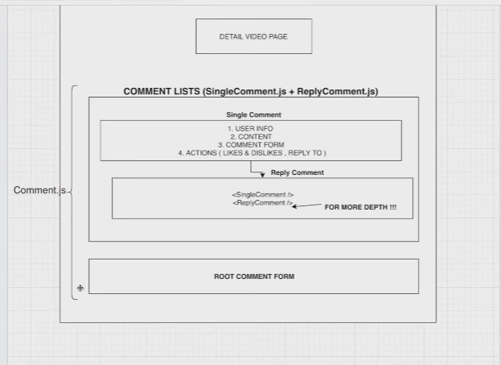

Boilerplate-mern-stack is being sponsored by the following tool  
Please help to support us by taking a look and signing up to a free trial

Hello, My Friends  
Thank you for having interest in this repository !  
 -> It's at the bottom(Link)

To use this application, 

1. make dev.js file inside config folder 
2. put mongoDB info into dev.js file 
3. Type  " npm install " inside the root directory  ( Download Server Dependencies ) 
4. Type " npm install " inside the client directory ( Download Front-end Dependencies )

# install

### client 
npm install react-dropzone --save 

### server
npm install multer --save

ffmpeg - download --using Thumbnail

npm install fluent-ffmpeg --save

## Information

Comment Structure

### Like & DisLike Structure
(1)  Like & DisLike 모델을 만든다 (Make Model) 
-> 비디오 좋아요 / 싫어요 (Video like/DisLike) 
-> 댓글 좋아요 / 싫어요(Commment like/DisLike) 

(2)  3가지 경우(Three Occation)

1. 아직 아무것도 클릭 안 돼있을 때 (Nothing is clicked)

2. 좋아요/싫어요 버튼이 이미 클릭이 돼있을 경우 한번더 누를떄 
(Button alreadly clicked-> press it once more)

3. 이미 다른 버튼이 클릭되어 있을 경우  
already clicked another button

You can watch the tutorial -> Click LINK!

###### Project_References 

: [LINK](https://www.youtube.com/channel/UCFyXA9x8lpL3EYWeYhj4C4Q?view_as=subscriber)

### 오늘 해봤다

